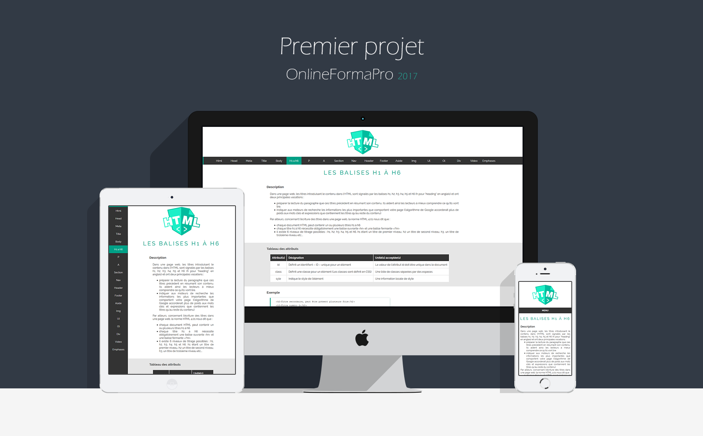

# Projet1OFP
1er Projet au sein du centre de formation OnlineFormaPro

Exercice: 
-Réaliser un site sur les balises HTML pour se familiariser avec le code HTML.
-Une balise par page.
-Chaque page doit contenir: une description, un tableau des attributs et un exemple.
-Réliser un CSS simpliste pour se familiariser avec.
